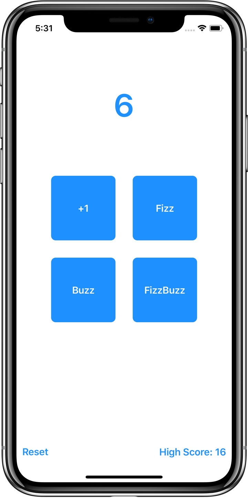
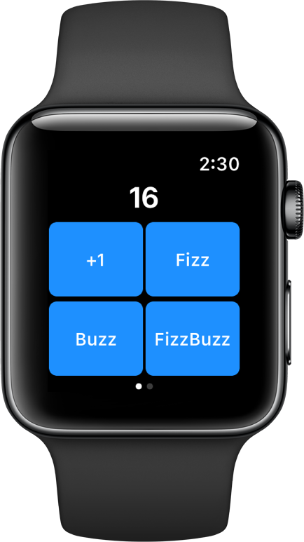

#  FizzBuzz the game

A complete FizzBuzz game to get a feeling for how testing works.

This project includes the app, as well as unit tests and UI tests.

Inspiration is taken from [here](https://medium.com/@ynzc/getting-started-with-tdd-in-swift-2fab3e07204b) (TDD tutorial by Yvette).

## Finished product

The finished product is the game FizzBuzz. It is pretty simple. But the project really shows how to use TDD to develop a small app. The same principle is applied to bigger projects.

 

## Teach yourself

Feel free to use this code to teach yourself test driven development (TDD). Use the [tutorial by Yvette](https://medium.com/@ynzc/getting-started-with-tdd-in-swift-2fab3e07204b) and my code to get a feeling for how TDD works and how you can incorporate it into your own projects.
Have fun.

## Code documentation

The whole project uses proper code documentation the way Xcode likes it. Because of this style, you are able to see all the information you need with `Quick Help`. Just `option` click on a variable to see the informations about it.
